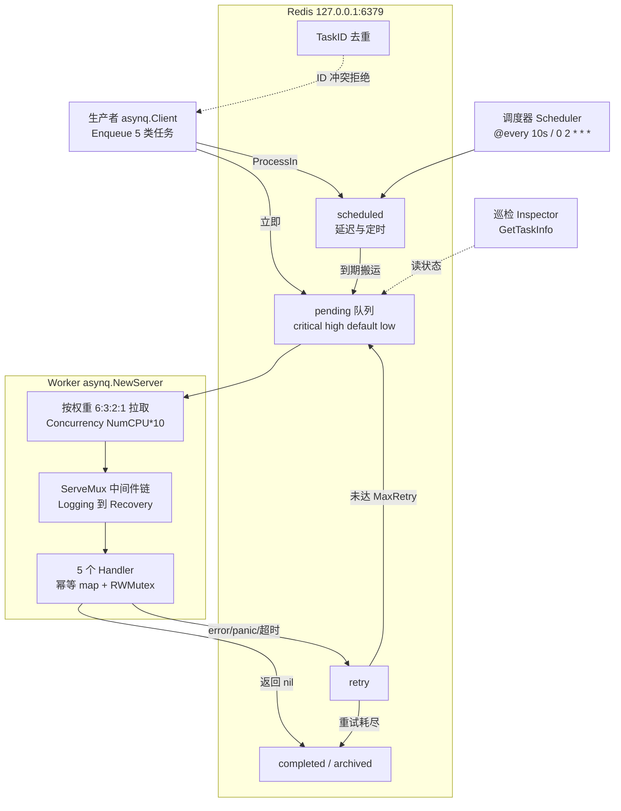
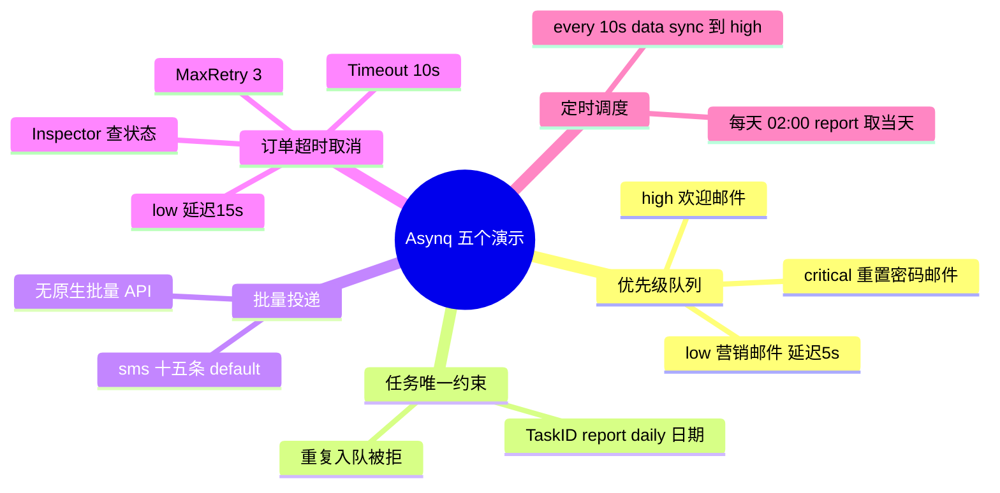
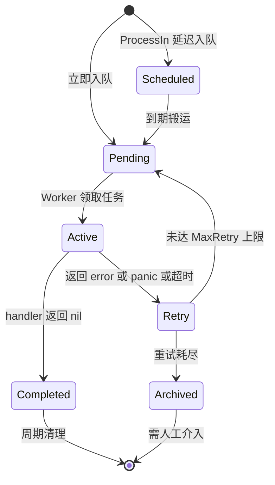
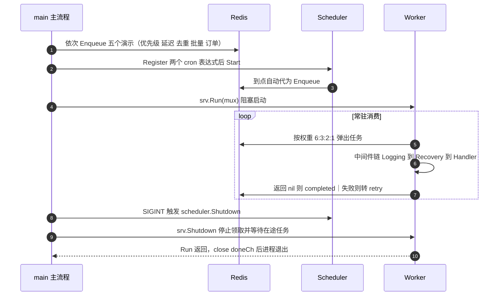

# Asynq 异步任务队列示例

Asynq 是基于 Redis 的分布式异步任务队列。本模块演示 Go 服务端最常见的任务场景：
优先级队列、延迟任务、任务唯一约束、批量投递、订单超时自动取消、Cron 定时调度，
以及 Worker 侧的并发控制、中间件、幂等和优雅退出。

## 依赖与快速开始

- 需要一个本地 Redis：`127.0.0.1:6379`（地址在 `main.go` 的 `redisAddr` 常量中）
- 程序既是**生产者**（入队演示）又是**消费者**（Worker），启动后会常驻运行

```sh
# 在仓库根目录
make run M=./Asynq

# 或者进入模块
cd Asynq && go run .
```

启动顺序：依次执行 5 个入队演示 → 启动 Cron 调度器 → 启动 Worker 阻塞消费。
按 `Ctrl+C` 触发优雅关闭（先停调度器，再停 Worker，等待在途任务完成）。

## 目录结构

```
Asynq/
├── main.go            # 入队演示 + Worker 启动 + 任务处理器 + 中间件
├── tasks/tasks.go     # 任务类型常量、Payload 结构与构造函数
└── README.md          # 本文档（含四张 Mermaid 架构图）
```

## 架构总览

四个视角看图：**组件架构 → 五个演示场景 → 任务状态流转 → 进程生命周期时序**。
本示例把生产者、调度器、消费者跑在同一个进程里（便于学习观察），真实项目中三者通常是独立部署的进程。

### ① 组件架构

Redis 既是消息中间件，也是任务状态的唯一存储：



> 看图重点：Redis 是唯一的状态载体，`scheduled` 到期后才搬运进 `pending` 队列；
> Worker 侧只关心“按权重拉取 → 中间件链 → Handler 返回 `nil`/`error`”这三步，
> 重试与归档完全由返回值决定。

#### 队列与路由映射

| 队列 | 消费权重 | 本示例中入队的任务 |
| :-- | :-- | :-- |
| `critical` | 6 | `email:deliver` 重置密码邮件 |
| `high` | 3 | `email:deliver` 欢迎邮件；`data:sync`（定时任务） |
| `default` | 2 | `report:generate`（唯一约束演示 + 每日报表）；`sms:notify` 批量 |
| `low` | 1 | `email:deliver` 营销邮件（延迟 5s）；`order:cancel`（延迟 15s） |

> 权重决定被选中的**概率比例**，不是给每个队列固定分配并发数；需要队列间硬隔离时，应启动多个 Worker 分别监听不同队列。

### ② 五个演示场景分支



对应代码：`main.go` 的 `[1/5]` 到 `[5/5]` 五段，任务定义集中在 `tasks/tasks.go`。

> 三类角色（生产者 / 调度器 / Worker）在生产中应拆成独立进程，本示例为便于观察写在同一个 `main.go` 里。

### ③ 任务状态流转



### ④ 进程生命周期时序（启动 → 运行 → 关闭）



单个任务内部的细节（幂等检查、payload 解析、耗时记录）可参考上面的状态流转图与下方「中间件与幂等」章节。

## 五个演示场景

| # | 场景 | 关键 API | 说明 |
| :-- | :-- | :-- | :-- |
| 1 | 优先级队列 + 延迟任务 | `asynq.Queue` / `asynq.ProcessIn` | 重置密码邮件进 `critical`，欢迎邮件进 `high`，营销邮件进 `low` 且延迟 5s |
| 2 | 任务唯一约束 | `asynq.TaskID` | 同一 `report:daily:<date>` 第二次入队会返回 `task ID conflicts with another task` |
| 3 | 批量投递 | 循环 `client.Enqueue` | asynq 没有原生批量 API，量大时应并发投递（如 errgroup）降低总耗时 |
| 4 | 订单超时自动取消 | `ProcessIn` / `MaxRetry` / `Timeout` + `Inspector` | 延迟 15s 取消、最多重试 3 次、单次执行 10s 超时，并用 Inspector 查状态 |
| 5 | Cron 定时调度 | `asynq.NewScheduler` / `Register` | `@every 10s` 数据同步；`0 2 * * *` 每天凌晨 2 点生成当天日报 |

任务类型统一采用 `domain:action` 命名（`email:deliver`、`sms:notify`、`data:sync`、
`report:generate`、`order:cancel`），便于按类型路由处理器和线上排查。

> 定时任务的日期不要在注册时写死：`tasks.NewDailyReportTask("daily")` 故意不填 `Date`
> 也不设 `TaskID`，由 Handler 执行时取当天，否则每天生成的都是启动那天的报表。

## Worker 配置

```go
concurrency := runtime.NumCPU() * 10 // 学习与调试建议用固定值（如 5），便于观察并发行为

srv := asynq.NewServer(asynq.RedisClientOpt{Addr: redisAddr}, asynq.Config{
    Concurrency: concurrency,
    Queues: map[string]int{
        "critical": 6,
        "high":     3,
        "default":  2,
        "low":      1,
    },
    // StrictPriority: true, // 开启后高优先级队列清空前不会消费低优先级
})
```

队列权重决定任务被选中的**概率比例**（`critical:high:default:low = 6:3:2:1`），
不是给每个队列固定分配并发数。若需要队列间互不抢占，应启动多个 Worker 实例分别监听不同队列。

## 中间件与幂等

`ServeMux` 采用洋葱模型，按注册顺序包装处理器：

- `LoggingMiddleware`：记录任务类型、ID、耗时与成功/失败
- `RecoveryMiddleware`：把 panic 转成 `error` 交给 asynq 重试，避免单个任务打挂整个 Worker

幂等演示用内存 map + `sync.RWMutex`（Handler 运行在多个 goroutine，裸 map 会有 data race）：

```go
var (
    taskExecuted   = make(map[string]bool)
    taskExecutedMu sync.RWMutex
)
```

多 Worker 实例部署时内存 map 失效，应改用 Redis `SET key value NX EX ttl` 或数据库唯一索引。

## 任务生命周期与状态查询

| Handler 返回值 | 结果 | 后续行为 |
| :-- | :-- | :-- |
| `nil` | 成功 | 任务完成并从待处理队列移除 |
| `error` | 失败 | 按重试策略重新入队，超过 `MaxRetry` 后归档 |

`client.Enqueue` 返回的是任务元信息（ID、队列），不是业务结果；异步任务的返回值必须由
Handler 自行写入数据库或 Redis，接口层再按业务 ID 查询。

通过 `asynq.NewInspector` 的 `GetTaskInfo(queue, taskID)` 可查询任务状态：
`pending` / `active` / `scheduled` / `retry` / `completed` / `archived`。

## 优雅关闭

```go
go func() {
    sig := <-sigCh
    scheduler.Shutdown() // 1. 停止产生新任务
    srv.Shutdown()       // 2. 停止领取新任务，等待在途任务完成
    <-doneCh
}()

if err := srv.Run(mux); err != nil { ... }
scheduler.Shutdown()
close(doneCh)
```

| 方法 | 行为 | 适用场景 |
| :-- | :-- | :-- |
| `srv.Shutdown()` | 停止接收新任务，等待执行中的任务完成 | 正常发布、缩容、服务退出 |
| `srv.Stop()` | 立即停止，不等待 | 紧急停止 |
| `scheduler.Shutdown()` | 停止定时调度器 | 服务退出前 |

## 配置速查

| 目标 | 机制 |
| :-- | :-- |
| 控制并发 | `Config.Concurrency` |
| 控制优先级 | `Queues` 权重、`StrictPriority` |
| 延迟执行 | `asynq.ProcessIn(d)` / `asynq.ProcessAt(t)` |
| 控制重试 | `asynq.MaxRetry(n)`（`0` 表示不重试） |
| 控制超时 | `asynq.Timeout(d)` |
| 任务去重 | `asynq.TaskID(id)` |
| 定时调度 | `Scheduler.Register("@every 10s", task)` / cron 表达式 |
| 查看状态 | `Inspector.GetTaskInfo` |
| 业务结果/进度 | 由 Handler 写入数据库或 Redis |
